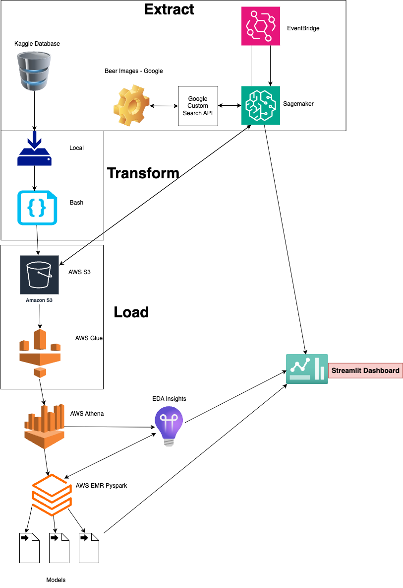

# PROYECTO BREWSMART
# Documentación del Recomendador de Cervezas BrewSmart 🍺

Este documento contiene la documentación necesaria para entender y utilizar el sistema de recomendación de cervezas BrewSmart. El sistema está diseñado para ayudar a los usuarios a encontrar cervezas que se adapten a sus preferencias y gustos personales.

## 📕 Descripción del Proyecto 
El sistema de recomendación de cervezas BrewSmart utiliza técnicas de aprendizaje automático y análisis de datos para proporcionar recomendaciones personalizadas a los usuarios. 

El sistema se basa en un conjunto de datos que contiene información sobre diferentes cervezas, incluyendo sus características, sabores y preferencias de los usuarios. 

En esta primera versión, se utiliza el conjunto de datos de Kaggle [Beer_Profile_and_Ratings](https://www.kaggle.com/datasets/aklil/beer-profile-and-ratings) para entrenar el modelo de recomendación.

En versiones futuras, productivas, el conjunto de datos se sustituirá por datos propios de BrewSmart, que incluirán información sobre las cervezas en inventario y las preferencias de los usuarios.

Se presentan dos apps de Streamlit al usuario: 

1. 📊📈 **Análisis del Inventario**: Permite al usuario analizar su inventario por cervecería y estilos. Además, esta herramienta permite comparar las características fundamentales de sabor de diferentes cervezas en inventario. 
   
2.🍺🍺 **Recomendador de Cervezas**: Permite al usuario encontrar cervezas que se adapten a sus preferencias y gustos personales. El sistema utiliza un modelo de recomendación basado en el contenido y un modelo de filtrado colaborativo para proporcionar recomendaciones personalizadas.

## 📚 Uso del proyecto
Para utilizar el sistema de recomendación de cervezas BrewSmart, sigue estos pasos:

1.  **Instalación**: Ejecuta el ambiente que acompaña el proyecto: 
   ```
   conda env create -f environment.yml
   conda activate cerveza
   ```
2. **Sesión AWS**: Asegúrate de tener tu configuración de AWS en orden. 
   Crea un archivo `.env` en la raíz del proyecto y añade las siguientes variables de entorno:
   ```
   BUCKET_NAME=bucket_s3
   AWS_ACCESS_KEY_ID=your_access_key_id
   AWS_SECRET_ACCESS_KEY=your_secret_access_key
   AWS_REGION=your_aws_region
   ```
3. **Preparación de datos**: Ejecuta el script de preparación de datos para limpiar y transformar los datos, para luego ser utilizados tanto por la app de análisis como el recomendador. 
   ```
   python main.py
   ```
4. **Ejecuta la app de análisis**: Ejecuta el script de la app de análisis para analizar tu inventario de cervezas.
   ```
   streamlit run src/py/eda_ui.py
   ```
5. **Ejecuta la app de recomendación**: Ejecuta el script de la app de recomendación para encontrar cervezas que se adapten a tus preferencias. 
   ```
   streamlit run src/py/streamlit_ui.py
   ```
# 📦 Arquitectura y Estructura del Proyecto

## Arquitectura del Proyecto

El proyecto BrewSmart realiza acciones de  limpieza, transformación y análisis de datos de cervezas, así como para proporcionar un sistema de recomendación.  A continuación se muestra la arquitectura del proyecto: 




## Estructura del Proyecto 
El proyecto BrewSmart contiene los siguientes directorios y archivos:


```bash
.
├── data
│   ├── clean
│   │   ├── beer_names_breweries_with_images.csv
│   │   └── beer_profile_and_ratings.csv
│   ├── queries
│   │   ├── cervezas_per_brewery.csv
│   │   ├── cervezas_per_style.csv
│   │   └── sensaciones_top_estilos.csv
│   └── raw
│       └── beer_profile_and_ratings.csv
├── src
│   ├── bash
│   │   ├── clean_data_1.sh
│   │   └── clean_data.sh
│   ├── notebooks
│   │   ├── Beers_Final_Project.ipynb
│   │   ├── eda_models-1.ipynb
│   │   ├── eda.ipynb
│   │   ├── get_data.ipynb
│   │   ├── get_picture_links.ipynb
│   │   └── Limpieza.ipynb
│   └── pipeline
│   │   ├── __init__.py
│   │   ├── pipeline_actualization_images.py
│   └── py
│       ├── __pycache__
│       ├── athena_db.py
│       ├── eda_ui.py
│       ├── load.py
│       ├── recommender.py
│       ├── streamlit_ui.py
│       ├── transform.py
│       └── utils.py
├── environment.yml
├── main.py
└── tree

10 directories, 24 files
```

### NOTA: 
Los archivos `.csv` en las carpetas `data/clean` y `data/queries` se crean a partir de los archivos `.csv` en la carpeta `data/raw`. En el repositorio, los archivos `.csv` en la carpeta `data/raw` son los archivos originales extraídos de Kaggle. 

Para uso personal, se recomienda cargar los archivos propios en `data/raw` y ejecutar el script `main.py` para limpiar y transformar los datos.

## 🗒️ NOTEBOOKS :
Los notebooks de la carpeta `src/notebooks` son para uso personal y no se utilizan en el flujo de trabajo del proyecto. El archivo `Beers_Final_Project.ipynb` es un notebook diseñado para ejecutarlo bajo entorno de Spark. Hace la misma limpieza y análisis de datos que el script `main.py`, pero utilizando Spark.

Los notebooks  `Limpieza.ipynb`, `eda_models-1.ipynb` y  `eda.ipynb` son para limpieza, análisis exploratorio de datos y visualización, se hicieron a modo de prueba y no se utilizan en el flujo de trabajo del proyecto. 

Los notebooks `get_data.ipynb` y `get_picture_links.ipynb` son para obtener los datos de Kaggle y las imágenes de las cervezas, respectivamente. Estos notebooks no se utilizan en el flujo de trabajo del proyecto, pero pueden ser útiles para obtener datos adicionales o imágenes de cervezas.

# 🐳 Dockerfile para BrewSmart

Este contenedor ejecuta automáticamente:

1. `main.py` para cargar datos a S3.
2. `eda_ui.py` para hacer consultas y generar CSV.
3. `streamlit_ui.py` para mostrar la app web.

## 🔧 Pasos para usarlo

### 1. Construir la imagen

Ejecuta el siguiente comando en la terminal desde la raíz del proyecto:

```
bash
docker build -t brewsmart .
```
Este comando construirá la imagen de Docker con el nombre `brewsmart`.


### 2. Ejecutar el contenedor
Antes de ejecutar el contenedor, asegúrate de tener tu configuración de AWS en orden. Crea un archivo `.env` en la raíz del proyecto y añade las siguientes variables de entorno:
```
BUCKET_NAME=bucket_s3
AWS_ACCESS_KEY_ID=your_access_key_id
AWS_SECRET_ACCESS_KEY=your_secret_access_key
AWS_REGION=your_aws_region
```
Luego hay que ejecutar el contenedor en varios pasos: :

 1. Procesamiento de datos, carga a S3 y generación de archivos para EDA: 
   
    ```
    bash
        docker run --rm --env-file .env brewsmart python main.py
    ```
 2. Visualización de EDA:  
        
    ```
    bash
        docker run -p 8501:8501 --env-file .env brewsmart streamlit run src/py/eda_ui.py
    ```

    Abre tu navegador en [http://localhost:8501](http://localhost:8501) para visualizar los resultados del análisis exploratorio de datos (EDA).

 3. Recomendador de cervezas:
        
    ```
    bash
        docker run -p 8502:8501 --env-file .env brewsmart streamlit run src/py/streamlit_ui.py
    ```

    Ignora lo que aparezca en la terminal si te pide abrir el localhost:8501. 
    
    Abre tu navegador en [http://localhost:8502](http://localhost:8502) para acceder a la aplicación de recomendación de cervezas.


